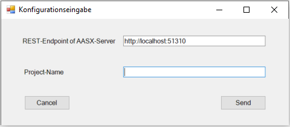
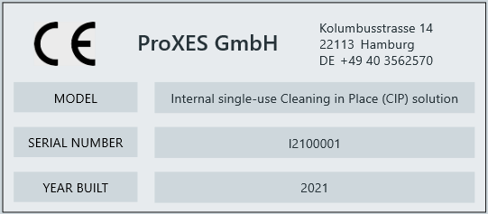
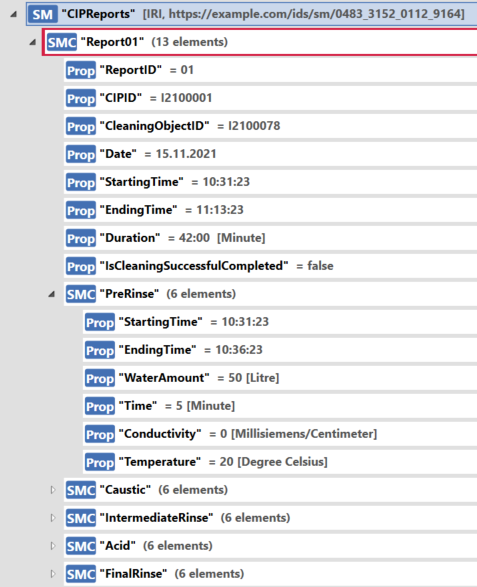

# Zenon Add-Ins for connecting to Asset Administration Shells (AAS)

This repository includes two C#-projects which are zenon Extensions (Add-Ins) for getting access to an Asset Administration Shell via zenon. It includes both the reading of data and writing it. The project is the result of a master thesis, which investigates the possibilities of combining MTP (Module Type Package) and Asset Administration Shells (AAS).

Zenon Add-Ins provide possibilities to extend the functionalities of zenon in the Editor and in the Runtime with different development environments. You can learn more about [here](https://download.copadata.com/fileadmin/user_upload/Downloads/Dokumentation/800SP0/ENGLISH/Manual/Programming_Interfaces.pdf). These can be read into zenon projects very easily, which is why they are published here.

## Prerequirements

This is what you need:
* [zenon Software Plattform](https://www.copadata.com/en/product/zenon-software-platform-for-industrial-automation-energy-automation/): Editor and Runtime (should work with all versions). For handling MTPs you also need the zenon POL.
* A zenon project in the zenon Editor. You can create it yourself or you can use the project of this master thesis as an example. You can find the project backup under `resources\projects\mtp-aas-project.zip`. You can load the project in your zenon Editor under File -> Read project backup back. 
* AASX Server: You can get it [here](https://github.com/admin-shell-io/aasx-server).
* Within this AASX-Server you need AASX-Files which are your Asset Administration Shells. The two demo AASX-Files (InstanceAAS and TypeAAS) of this project you can find under the `\aasxs` directory. In the InstanceAAS you need the Nameplate-Submodel after that specific [standard](https://www.zvei.org/fileadmin/user_upload/Presse_und_Medien/Publikationen/2020/Dezember/Submodel_Templates_of_the_Asset_Administration_Shell/Submodel_Templates-Asset_Administration_Shell-ZVEI-digital_nameplate.pdf).
* Micrsoft Visual Studio (Community, Professional, Enterprise) 2015 or higher. Download this [COPA-DATA Developer Tool](https://marketplace.visualstudio.com/items?itemName=vs-publisher-1463468.COPA-DATASCADAAdd-InDeveloperToolsforVS) for creating your own extensions. 
* AASX Package Explorer for opening aasx-Files in a clear visualization. You can get it [here](https://github.com/admin-shell-io/aasx-package-explorer).

## What's in this Repo?

As already said, this repository includes two projects. Each of it represent a zenon Add-In. That's why the description is divided into two single parts. The two projects have a different aim of functionality:
* CreateNameplate-Project: This project is for reading data from the Asset Administration Shell and creates variables out of this data. Especially in this case it reads the Nameplate-Submodel of the Asset Adminsitration Shell. This is a standardized submodel for a digital nameplate. The standardized specification you can find [here](https://www.zvei.org/fileadmin/user_upload/Presse_und_Medien/Publikationen/2020/Dezember/Submodel_Templates_of_the_Asset_Administration_Shell/Submodel_Templates-Asset_Administration_Shell-ZVEI-digital_nameplate.pdf). After reading the submodel it is visualized in zenon.
* TrackCleaning-Project: This project is for writing data into an Asset Administration Shell. It is a litte bit specific to the Use-Case of the master thesis: Engineering and reporting of a Clean in Place (CIP) module with the combination of MTP and AAS. When one cleaning process is finished, it writes the details of the process to the InstanceAAS in the Submodel CIPReports.  

## CreateNameplate-Project

As already said this project is for reading data from the Asset Administration Shell. The type of this project is a zenon Editor Service Extension. This extension is carried out automatically when the zenon Editor is started, as you can read in the manual [here](https://download.copadata.com/fileadmin/user_upload/Downloads/Dokumentation/800SP0/ENGLISH/Manual/Programming_Interfaces.pdf).

### Configuration

* To add the implemented extension to your project, you have to navigate in the Editor under Extras -> Manage Editor Add-Ins. There you have to add the compiled .scadaAddIn-File of the project under `bin\Debug`.
* You can start the extension manually under Extras -> Manage Editor services. For this extension it is configured that the default start mode is automatic. So when you restart the editor it should start as well. 
* When starting the extension a Windows Forms window will pop up: . 
  
    Here you can enter your specific REST-Endpoint of the AASX-Server. Also you can enter the name of your zenon project in which the nameplate should be created. It automatically creates the nameplate in the screen "Prozessbild" of your entered project.
* If you want to have a fallback which is always used when entering wrong or no values in the Form Window, you have to do some editation. Navigate to the `Congig\App.config`-file. Here are the standard values of the input parameters defined: AASServerURL, ProjectName and ScreenName. Put in your specific data, recompile and add the recompiled file in the editor. After that you have a fallback for your specific case. 

### Usage
* After a restart of the zenon Editor the extension reads the Nameplate-Submodel of the InstanceAAS of the AASX Server and creates Variables of the needed information for creating a digital nameplate in zenon. The output window will you give you some information what is happening. 
* When the creation of the variables is finished, the extension creates zenon Screen Elements for visualizing the nameplate in zenon. In this example the digital nameplate is created in the "Prozessbild"-Screen.
* Here you can see how it will look like for the use-case of the master thesis: 

## TrackCleaning-Project

This project is for writing data into the Asset Administration Shell. The type of this project is a zenon Project Service Extension. This extension executes automatically when starting the project in the zenon Runtime, as you can read in the manual [here](https://download.copadata.com/fileadmin/user_upload/Downloads/Dokumentation/800SP0/ENGLISH/Manual/Programming_Interfaces.pdf).

### Configuration
* To add the implemented extension to your project, you have to navigate to your project tree. There click on Programming Interface -> Add-Ins to see the detail view. There you have to add the compiled .scadaAddIn-File of the project under `bin\Debug`.
* For this extension it is configured that the default start mode is automatic. So when you start the zenon Runtime it should start as well.
* Navigate to the Config\App.config-File. Here are the standard values of the input parameters defined: AASServerURL, CIP_ServiceControl_StateCur and CIP_ServiceControl_ProcedureCur. The two last parameters are specific to the use-case. When these variables change, details are written in the Asset Administration Shell. You can edit the parameters for your specific use-case. But don't forget to recompile your project after that and add the recompiled file in the your project tree. 

### Usage
* When starting the zenon Runtime, the extension will track one variable in an online container for changing values. In this use-case it tracks the StateCur of the CIP service. After finishing the CIP-Service it writes a CIPReport-SubmodelElementColletion in the CIPReports-Submodel of the InstanceAAS. 
* You can download the updated AAS of your AASX Server. For this project setting it would be for example this command: `http://localhost:51310/server/getaasx/0`. After downloading the aasx-File you can open it in the AASX Package Explorer to see the new entry in detail. 
* Here you can see the new added SubmodelElementCollection Report01: 